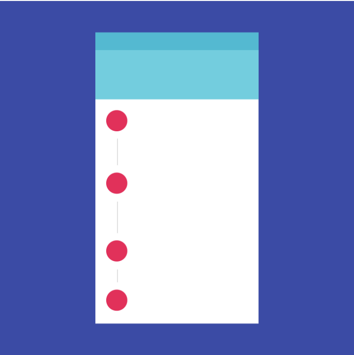
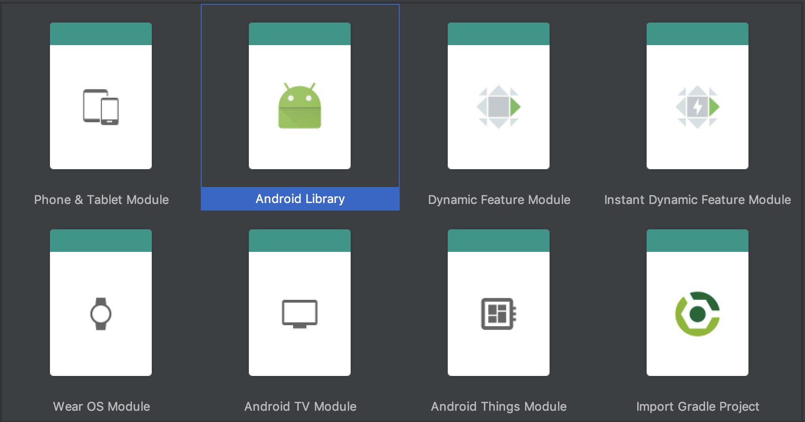

# First Exercise

https://github.com/fython/MaterialStepperView.git

<h1 align="center">CREATING A MATERIAL STEPPER VIEW IN ANDROID </h1>
<h2 align="center">POWERED BY CARLITOSDROID </h2>

<p align="center">
    
</p>

## SUMMARY
According to the [Official Documentation][4], Steppers display progress through a sequence of logical and numbered steps. They also may be used for navigation. Steppers may display trasient feedback message after a step is saved.

## What about Steppers for Android Mobile Applications?
When it comes to Android application development, we need to make sure we are using the right type of stepper. Are there types of Steppers? Yes, and also type of steps as shown below:

### Types of Steppers
* Horizontal
* Vertical
* Linear
* Non-linear

### Types of Steps
* Editable 
* Non-editable
* Mobile
* Optional

In a nutshell, when it comes to Android the best choice is `Vertical Stepper` and `Mobile Steps`. They are ideal for mobile and the official website recommends it.

## Creating our component for Android
When creating a custom component(view) regardless of the platform, we always have to think about it as an open source project, where we can help each other with people. Doing that way we'll receive feedback, improve quality, scalability, reusability, help people and build our software faster. 

This time, we are going to learn step by step how to create necessary classes, layouts and resources in order to design our Componentes according to the official website.

## Creating our MaterialStepperView Component
0. There are several ways to create our MaterialStepperView, we can do it without by using only Views, ViewGroups. For our purpose, let's take advantage of a very useful component in Android which is the RecyclerView. Maybe you must be wondering why?. Take a look at this:
    * RecyclerView and ViewHolder both are already optimized to work with big amount of Data, if in a future we want to add a lot of steps, it will scale without problems.
    *  We've also choosen RecyclerView, because there's a common design per each item, the title, the summary, the step number, the vertical line.
    * The user only has to add their custom view for the contennt in each step.

# LET'S GET STARTED
## 1. Add a New Module
The best idea when creating a custom view or component that will increase in a near future is to create it as an Android Library and make it open source, in order to get feedback and collaborate with community. Maybe if our component has a punctual functionality it wouldn't necessary to create it as an Android Library.
Let's add a new Android Library Module
<p align="center">
    
</p>

# THE VERTICAL STEPPER ITEM VIEW
## 2. In our New Module(Android Library), let's create the layout wich will represent each step

Our final layout design:
<p align="center">
    
</p>

And layout file would look like this: 

`vertical_stepper_item_view.xml`
```xml
<?xml version="1.0" encoding="utf-8"?>
<LinearLayout xmlns:android="http://schemas.android.com/apk/res/android" xmlns:tools="http://schemas.android.com/tools"
              android:orientation="horizontal"
              android:layout_width="match_parent"
              android:layout_height="wrap_content"
              android:baselineAligned="false"
              android:paddingStart="24dp"
              android:paddingEnd="24dp">

    <LinearLayout
            android:layout_width="24dp"
            android:layout_marginEnd="12dp"
            android:layout_height="match_parent"
            android:orientation="vertical">

        <TextView
                android:id="@+id/tvStepNumber"
                android:layout_width="match_parent"
                android:layout_height="24dp"
                android:gravity="center"
                android:textColor="@android:color/white"
                android:text="1"
                android:background="@drawable/bg_step_enable"/>

        <View android:layout_width="1dp"
              android:layout_height="0dp"
              android:layout_marginTop="8dp"
              android:layout_marginBottom="8dp"
              android:layout_gravity="center_horizontal"
              android:layout_weight="1"
              android:background="@color/material_grey_400"/>

    </LinearLayout>

    <LinearLayout
            android:layout_width="match_parent"
            android:layout_height="wrap_content"
            android:orientation="vertical">

        <TextView
                android:id="@+id/tvTitle"
                android:layout_width="match_parent"
                android:layout_height="wrap_content"
                android:maxLines="2"
                tools:text="Title"/>

        <TextView
                android:id="@+id/tvSummary"
                android:layout_width="match_parent"
                android:layout_height="wrap_content"
                tools:text="Summary"
                android:textColor="@color/material_grey_400"/>

        <FrameLayout
                android:layout_width="match_parent"
                android:layout_height="wrap_content"
                android:id="@+id/flContent"/>

    </LinearLayout>

</LinearLayout>

```


## 3. Just as an example, we are going to define our necessary drawable resources. For example, if we want to change the state of our StepperNumber, we can have:

`bg_step_enable.xml`
```xml
<?xml version="1.0" encoding="utf-8"?>
<shape xmlns:android="http://schemas.android.com/apk/res/android"
       android:shape="rectangle">
    <corners android:radius="12dp"/>
    <solid android:color="@color/material_blue_500"/>
</shape>
```
`bg_step_disable.xml`
```xml
<?xml version="1.0" encoding="utf-8"?>
<shape xmlns:android="http://schemas.android.com/apk/res/android"
       android:shape="rectangle">
    <corners android:radius="12dp"/>
    <solid android:color="@color/material_grey_500"/>
</shape>
```
<p align="center">
    
</p>
<p align="center">
    
</p>


## 4. The StepState class
Sometimes when we want to define a group of types or objects in common, the first idea that comes to our mind is about Enums. What about Enums?. So they are great when you take advatange of all their features, but for android enums consume much more memory and we only want to define simple states. A great way to do this is through @Intdef annotation available for Java and Kotlin.

´´´

class StepStates {

    @IntDef(StepStates.STATE_NORMAL, StepStates.STATE_SELECTED, StepStates.STATE_DONE)
    @Retention(AnnotationRetention.SOURCE)
    annotation class StepState

    companion object {
        const val STATE_NORMAL = 0
        const val STATE_SELECTED = 1
        const val STATE_DONE = 2
    }
}
´´´

Doing so, we can handle the states of our steps number.
<p align="center">
    
    
    
</p>

## 5. In the end, everything will take place in this class `VerticalStepperItemView`

```kotlin

class VerticalStepperItemView : FrameLayout {

    constructor (context: Context) : super(context)

    constructor (context: Context, attrs: AttributeSet?) : super(context, attrs)

    init {
        View.inflate(context, R.layout.vertical_stepper_item_view, this)
    }

    fun setTitle(title: String) {
        tvTitle.text = title
    }

    fun setSummary(summary: String) {
        tvSummary.text = summary
    }

    fun setColorStep() {
        tvStepNumber.setBackgroundResource(R.drawable.bg_step_enable)
    }

    fun addCustomContentView(view: View) {
        flContent.addView(view)
    }

    fun setState(@StepStates.StepState stepState: Int){
        when(stepState){
            StepStates.STATE_NORMAL -> {
                tvStepNumber.setBackgroundResource(R.drawable.bg_step_disable)
            }

            StepStates.STATE_DONE -> {
                tvStepNumber.setBackgroundResource(R.drawable.bg_step_enable)
            }

            StepStates.STATE_SELECTED -> {
                tvStepNumber.setBackgroundResource(R.drawable.bg_step_enable)
            }
        }
    }
    
}

```
# THE IStepperAdapter INTERFACE
## 6. The next step is to create an Interface wich will be in charge to define the number of steps,the title, summary and custom view that user need per each step:

```kotlin

interface IStepperAdapter {

    abstract fun getTitle(index: Int): CharSequence

    abstract fun getSummary(index: Int): CharSequence?

    abstract fun size(): Int

    abstract fun onCreateCustomView(index: Int, context: Context, parent: VerticalStepperItemView): View
}
```

# The Step Model Class
```kotlin
data class Step(var title: String, var summary: String, var stepState: Int = StepStates.STATE_NORMAL)
```
## This is class will represent the common parts in every step, such as the title, summary, state and so on.
## ´Keep in mind, whole component depends on our Step Model Class´, the model class represents what we are going to show visually

# THE VERTICAL STEPPER VIEW

## 7. In the same way as VerticalStepperItemView, our `VerticalStepperView` will inflate its own layout `vertical_stepper_view.xml` which has RecyclerView.
```xml
<?xml version="1.0" encoding="utf-8"?>
<android.support.v7.widget.RecyclerView
        xmlns:android="http://schemas.android.com/apk/res/android"
        xmlns:app="http://schemas.android.com/apk/res-auto"
        android:id="@+id/rvStepperView"
        android:layout_width="match_parent"
        android:layout_height="match_parent"
        android:paddingTop="24dp"
        android:clipToPadding="false"
        app:layoutManager="android.support.v7.widget.LinearLayoutManager"/>
```


## 8. Let's create a class called `VerticalStepperView` according to the official website. This class is our main component. User will declare it in their XML file. For Example
```kotlin
class VerticalStepperView : FrameLayout {

    private var stepperAdapter: IStepperAdapter? = null

    private val itemAdapter = ItemAdapter()

    private var stepList: MutableList<Step>? = null

    constructor (context: Context) : super(context)

    constructor (context: Context, attrs: AttributeSet?) : super(context, attrs)

    init {
        View.inflate(context, R.layout.vertical_stepper_view, this)
    }

    fun setStepList(stepList: MutableList<Step>) {
        this.stepList = stepList
        itemAdapter.notifyDataSetChanged()
    }

    fun setStepperAdapter(mStepperAdapter: IStepperAdapter) {
        this.stepperAdapter = mStepperAdapter
        rvStepperView.adapter = itemAdapter
    }

    fun setCurrentState(@StepStates.StepState stepState: Int, position: Int) {
        for (step in stepList!!) {
            step.stepState = StepStates.STATE_NORMAL
        }
        if(position < stepList!!.size -1){
            stepList!![position+1].stepState = stepState
            itemAdapter.notifyDataSetChanged()
        }
    }

    private inner class ItemAdapter : RecyclerView.Adapter<ItemAdapter.ItemViewHolder>() {
        override fun onCreateViewHolder(parent: ViewGroup, p1: Int): ItemViewHolder =
            ItemViewHolder(VerticalStepperItemView(parent.context))

        override fun getItemCount(): Int = stepperAdapter!!.size()

        override fun onBindViewHolder(itemViewHolder: ItemViewHolder, position: Int) {
            itemViewHolder.bind(stepList!![position])
        }

        inner class ItemViewHolder(var verticalStepperItemView: VerticalStepperItemView) :
            RecyclerView.ViewHolder(verticalStepperItemView) {
            fun bind(step: Step) {
                verticalStepperItemView.setTitle(step.title)
                verticalStepperItemView.setSummary(step.summary)
                verticalStepperItemView.setColorStep()
                verticalStepperItemView.setState(step.stepState)

                val customView =
                    stepperAdapter!!.onCreateCustomView(position, context, verticalStepperItemView)
                verticalStepperItemView.addCustomContentView(customView)
            }
        }
    }
}
```
## 8. The final user(developer) will only have to implement our component on this way

```xml
<com.example.steppers.VerticalStepperView
            android:id="@+id/vsvStepper"
            android:layout_width="match_parent"
            android:layout_height="match_parent"/>
```


# 9. IMPLEMENTING THE COMPONENT IN THE MAIN ACTIVITY

Our class will looks like this
```kotlin

class MainActivity : AppCompatActivity(), IStepperAdapter {

    private val stepList by lazy {
        mutableListOf(
            Step(
                getString(R.string.select_application),
                getString(R.string.select_first_step),
                StepStates.STATE_SELECTED
            ),
            Step(getString(R.string.setting_up_analytics), getString(R.string.the_second_step)),
            Step(getString(R.string.select_ad_format), getString(R.string.last_step))
        )
    }

    override fun onCreate(savedInstanceState: Bundle?) {
        super.onCreate(savedInstanceState)
        setContentView(R.layout.activity_main)
        vsvStepper.setStepperAdapter(this)
        vsvStepper.setStepList(stepList)
    }

    override fun getTitle(index: Int): CharSequence = stepList[index].title

    override fun getSummary(index: Int): CharSequence? = stepList[index].summary

    override fun size(): Int {
        return stepList.size
    }

    override fun onCreateCustomView(index: Int, context: Context, parent: VerticalStepperItemView): View {
        val inflated = LayoutInflater.from(context).inflate(R.layout.content_view, parent, false)

        inflated.btnOk.setOnClickListener {
            vsvStepper.setCurrentState(StepStates.STATE_SELECTED, index)
        }
        return inflated
    }
}    

```

## 10. Additional Tasks: Uploading library to Jitpack

Just as a reminder, In order to improve make our library public. We can do it by selecting an artifactory there are a lot of them, for our purpose we will choose JitPack which is free :3. You can do it something like this.

```gradle
implementation 'com.example.carlitosdroid:MaterialStepperView:1.0.0-alpha1'
```

## 11. NEXT STEPS: Creating our MaterialStepsView Component, but I need some more time 

## 12. Happy Coding!!!!
[4]: https://material.io/archive/guidelines/components/steppers.html#


Go to Exercises:
# [First Exercise][1]
# [Second Exercise (shake animation)][2]
# [Second Exercise (shake action)][3]
# [Third Exercise][4]
# [Four Exercise][5]

[1]: https://github.com/CarlitosDroid/android-exercises-resolution/tree/exercise_1_stepper
[2]: https://github.com/CarlitosDroid/android-exercises-resolution/tree/exercise_2_shake_animation
[3]: https://github.com/CarlitosDroid/android-exercises-resolution/tree/exercise_2_shake_action
[4]: https://github.com/CarlitosDroid/android-exercises-resolution/tree/exercise_3_mvp_project
[5]: https://github.com/CarlitosDroid/android-exercises-resolution/tree/exercise_3_mvp_project


