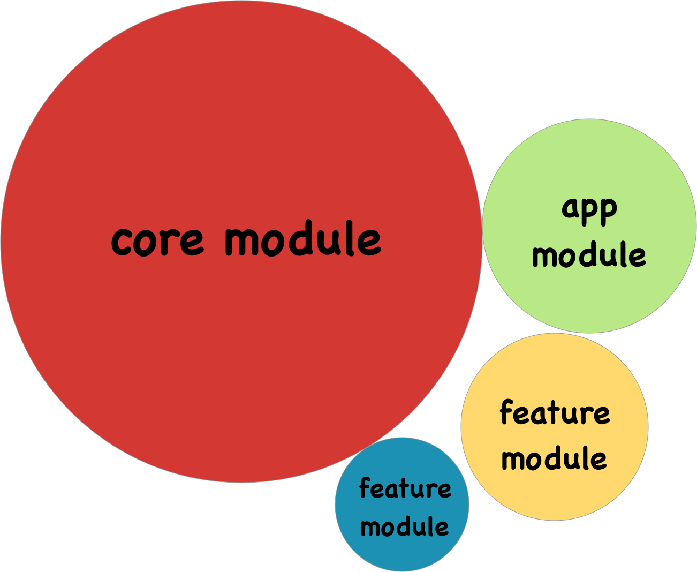
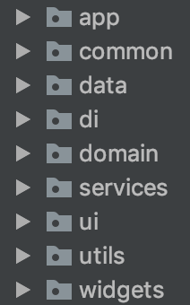
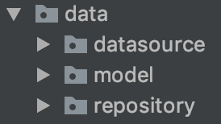
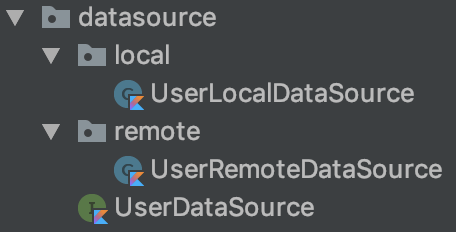
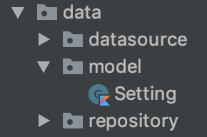
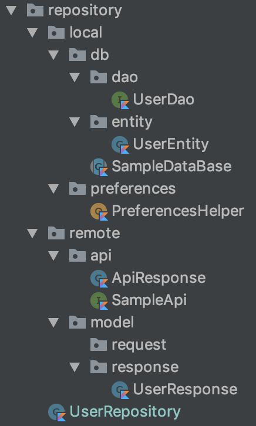
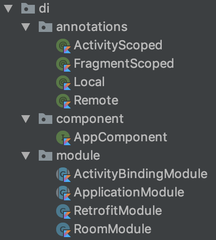

# Third Exercise

# How to create a modularized MVP project?

## Let's define our modules
1. First off, we need to create a `core` module, which is going to contain shared dependencies. The main idea behind Core module is to provide objects that can be used throught the app. The core module is basically an Android Library (we can shared dagger components, we can shared customs views, animators, utils, handlers, etc, etc)

2. Then the `app` module, which contains the main launcher activity. The app module depends on a core module which contains shared code and resources as well as third party libraries.

3. If we want to add new, we can add `dynamic feature modules`, which contains at least one activity, code and resources related to only the feature in question. Google has released new distribution features (Instant apps, app bundles, dynamic feature module), and these newer tools are aimed to modularized applications. We should take advantages of these features.

    

As you can see in the picture, the idea is aimed to have a modularize application with different modules.

4. In order to take advantage of `Dependency Injection` design patern which allows us loose coupling (architecture principle). We need to add a Dagger folder in every module in order to share Dagger Components and use dependencies in every module. Don't forget [`a class shouldn’t know anything about how it is injected`][6]

# 5. Now the MVP(architectural pattern), The way that I define it in a module is as follow below:

    

* A `di` folder. (di stands for dependency injection)

# 6. The `data` package:

    

* The data folder havs the `repository`, `model` and `datasource` folders. 

# 7. The `datasource` package:

    

* The datasource folder is in charge to have all datasource classes which have the responsability of getting data without any validation or business logic, just get row data from database or network. That's why we have local and remote folders and an interface which defines functionality and it's implemented in both classes.

# 8. The `model` package:

    

* The model only has classes which their only responsibility is to transport data.

# 9. The `repository` package:

    

* As you can see we have two main packages `local` and `remote` and the `UserRepository` class.
### The `local` folder
* The `local` folder has the `DataBase`, `dao`(database access object) and `entities`. It also has the `preferences` package. Everything related to local data.
### The `remote` folder
* The `remote` folder has the `api` and `model` folders. Inside the `api` we can configure our http clients(whatever we want) and inside the `model` folder we have classes which represents `request` and `response` entities.
### The `UserRepository` class
* Having repositories is a good practice, the main difference between Repositories and DataSource is that Repositories uses DataSources and can apply additional task like saving data in caché.

# 10. The `domain` folder
* This folder contains UseCases classes which uses repository classes. The idea of having them is to make works with repositories or for example convert responses of data to another model like mappers.

# 11. The `ui` folder
* Here we'll have the different screens split them into folders. For example if we have views like HomeActivity, DetailActivity, SearchActivity, or maybe fragments. So we will have home, detail and search folder respectively.
* In addition, we have the `presenter` class per each folder.

# 12. The `service` folder
* Other entrypoints to android applications are services that's why we have it as a separate folder.

# 13. The `broadcast` folder
* Another entrypoints to android application is broadcastReceiver that's why we have it as a separate folder.

# 14. The `di` folder

    

### The `annotations` folder
* Here we can have annotations which makes us to define scopes for our dependencies. They might be visible for certain classes. 
### The `components` folder
* Components are brigde between modules and our classes that requires dependencies.
### The `modules` folder
* Contains our dependencies

# 15. The `utils` folder
* Always it's necessary having utils for several reasons. Our utils folder will be part of our `core` module. This folder can contains everything that can be used across different classes and modules. For example:
StringUtils, ColorUtils, Helpers, ExtensionsFunctions, Observers, Executors and so on.

# 16. The `widget` folder
* When creating widgets(custom views). It's much better having them separate in a widget folder. Doing so they are easy to identify and use.

[6]: https://google.github.io/dagger/android

Go to Exercises:
# [First Exercise][1]
# [Second Exercise (shake animation)][2]
# [Second Exercise (shake action)][3]
# [Third Exercise][4]
# [Four Exercise][5]

[1]: https://github.com/CarlitosDroid/android-exercises-resolution/tree/exercise_1_stepper
[2]: https://github.com/CarlitosDroid/android-exercises-resolution/tree/exercise_2_shake_animation
[3]: https://github.com/CarlitosDroid/android-exercises-resolution/tree/exercise_2_shake_action
[4]: https://github.com/CarlitosDroid/android-exercises-resolution/tree/exercise_3_mvp_project
[5]: https://github.com/CarlitosDroid/android-exercises-resolution/tree/exercise_3_mvp_project